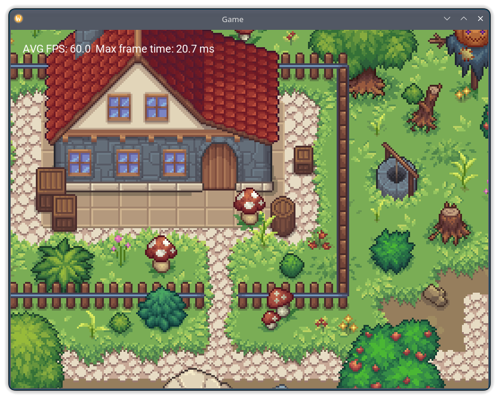

# Engine Demo
A demo application using [my game engine](https://github.com/Mandeson/Engine.git).
It consists of a multi-layer tilemap and a player sprite (also form the tilemap).
The player can move using WSAD, arrows or pressing edges of the screen on Android devices.
Player position is linearly interpolated to provide smooth camera movement. The position is rounded to the nearest pixel when still.


### Supported platforms
* Android
* Linux
* Windows
* MacOS

### Requirements
* GPU compatible with one of the following:
  * OpenGL 3.0+
  * OpenGL 2.1 with GL_EXT_framebuffer_object extension
  * OpenGL ES 2.0

### Building
#### Android
Open ```android``` folder in Android Studio (Panda or newer, with NDK installed), connect a supported Android device with USB Debugging enabled and click _Run_ or _Debug_. The required libraries will be automatically downloaded.
#### Linux
**Prerequisites**:
* GCC 13+ or Clang 17+
* glibc 2.37
* CMake 3.6+

The easiest way to build on any GNU/Linux distribution is to download and compile dependencies automatically alongside the engine:

```
cmake -DENGINE_USE_SYSTEM_LUA_LIB=OFF -DENGINE_USE_SYSTEM_GLM_LIB=OFF -DENGINE_USE_SYSTEM_FREETYPE_LIB=OFF -DENGINE_USE_SYSTEM_NLOHMANN_JSON_LIB=OFF -DENGINE_USE_SYSTEM_GLFW_LIB=OFF -DCMAKE_POLICY_VERSION_MINIMUM=3.5 -DCMAKE_BUILD_TYPE=Release -B build -S .
cd build
make -j16
```
Alternatively, install required libraries (Lua, glm, freetype, nlohmannjson and GLFW) with a package manager and run
```
cmake -DCMAKE_BUILD_TYPE=Release -B build -S .
cd build
make -j16
```
Then run the demo (the program binary is located in the parent folder):
```
cd ..
./EngineDemo
```
#### Windows
**Prerequisites**:
* MSVC 2019 version 16.10 or newer with Build Tools
* CMake 3.6+

Open Microsoft x64 Native Tools Command Prompt. Enter the project directory. Type:
```
cmake -DCMAKE_POLICY_VERSION_MINIMUM=3.5 -DCMAKE_BUILD_TYPE=Release -G "NMake Makefiles" -B build -S .
cd build
nmake
```
Then run _EngineDemo.exe_ in the parent folder
#### MacOS
**Prerequisites**:
* Apple Clang 17+
* CMake 3.6+

Open CMake GUI. Select the project folder and create a build folder. Add variable **CMAKE_POLICY_VERSION_MINIMUM** and set it to _3.5_. Then click Configure and Generate. The required libraries will be automatically downloaded. Enter the build folder in a terminal and type:
```
make
```
Then enter the root repo folder and launch the demo:
```
./EngineDemo
```

### Assets
The assets used in the app are from [CRAFTPIX](https://craftpix.net/file-licenses/) free tilesets.